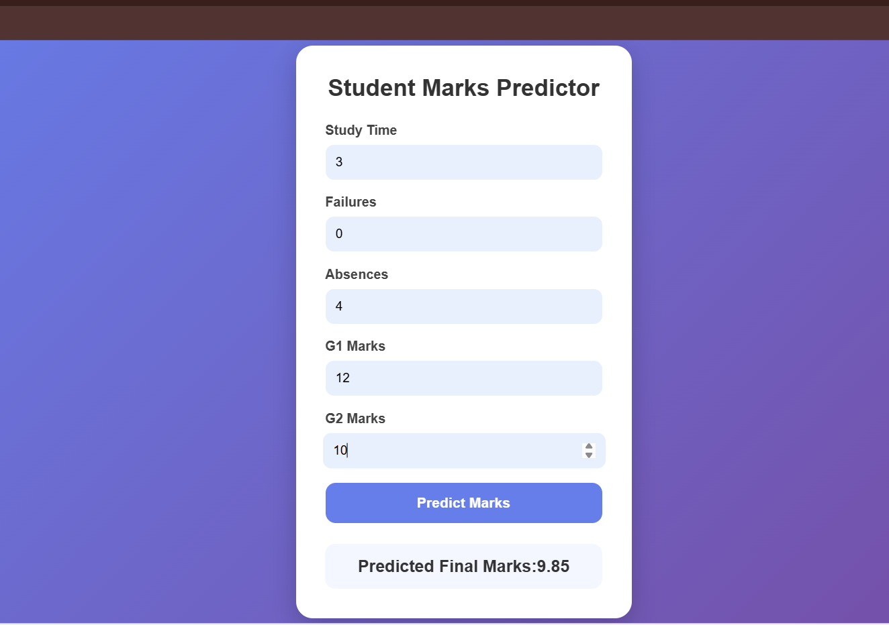

# 🎓 Student Performance Prediction

An AI-powered web application that predicts student academic performance using Machine Learning techniques. This project helps analyze student-related factors and provides performance predictions based on input data.

---

## 📌 Project Overview

The Student Performance Prediction System is designed to predict whether a student is likely to perform well academically based on various parameters such as study hours, attendance, previous scores, parental involvement, and other educational factors.

The project uses Machine Learning algorithms to analyze data and generate accurate predictions through a simple and interactive web interface.

---

## 🚀 Features

- 📊 Predict student academic performance
- 🤖 Machine Learning-based prediction model
- 🌐 User-friendly web interface
- 📈 Data preprocessing and analysis
- 🧠 Real-time prediction results
- 💻 Responsive design for all devices

---

## 🛠️ Technologies Used

### Frontend
- HTML
- CSS
- JavaScript

### Backend
- Python
- Flask

### Machine Learning
- Scikit-learn
- Pandas
- NumPy

---

## ⚙️ Installation

### 1️⃣ Clone the Repository

```bash
git clone https://github.com/your-username/student-performance-prediction.git
```

### 2️⃣ Navigate to the Project Folder

```bash
cd student-performance-prediction
```

### 3️⃣ Install Required Packages

```bash
pip install -r requirements.txt
```

### 4️⃣ Run the Application

```bash
python app.py
```

---

## 📊 Machine Learning Workflow

- Data Collection
- Data Cleaning
- Feature Engineering
- Model Training
- Model Evaluation
- Prediction Generation

---

## 📸 Project Preview

### Home Page



